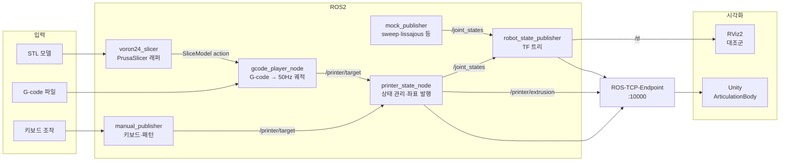

# 3DPrinter-onUnity-byROS

3D 프린터(Voron 2.4 R2 (250 mm)) 모델의 Unity **시뮬레이션**.    

ROS2를 통한 Unity 환경 내 프린터 모델 메뉴얼 키보드 조작 및 STL --> G-code 변환 동작.

---

## 아키텍처



### 기구 모델

Voron 2.4는 **CoreXY + Flying gantry**. 베드: 프레임 고정, 갠트리: Z축 승강.

```
base_link (프레임 + 베드 + 전장)
├── z_gantry   prismatic Z ─ 갠트리 전체 승강
│   └── x_beam   prismatic Y
│       └── toolhead   prismatic X
│           └── nozzle   fixed (TCP)
└── bed_origin   fixed ─ G-code (0,0,0) 기준점
```

---

## 레포 구조

```
3DPrinter-onUnity-byROS/
├── docs/                        설계 문서
├── ros2_ws/src/
│   ├── voron24_description/     URDF (xacro) · 메시
│   ├── voron24_msgs/            PrinterCommand · PrinterStatus · ExtrusionPoint
│   ├── voron24_gcode/           G-code 파서 · 플레이어 · mock 퍼블리셔
│   ├── voron24_slicer/          PrusaSlicer 래퍼
│   ├── voron24_slicer_msgs/     SliceModel.action
│   ├── voron24_bringup/         mock.launch.py · sim.launch.py
│   └── ROS-TCP-Endpoint/       Unity 브릿지 (vcs import)
├── unity/Voron24Twin/           Unity 프로젝트 (2022.3 LTS, URP)
│   └── Assets/Scripts/Robot/    JointStateSubscriber · KeyboardJointController · ...
└── tools/                       contract_check.py · smoke_test.sh · make_test_gcode.py
```

| 경로 | 설명 |
|---|---|
| `docs/` | 설계 문서. `00_interface_contract.md`가 근거 문서 |
| `ros2_ws/src/voron24_description/` | URDF (xacro), 파라미터, 메시 |
| `ros2_ws/src/voron24_msgs/` | 커스텀 메시지 (`PrinterCommand`, `PrinterStatus`, `ExtrusionPoint`) |
| `ros2_ws/src/voron24_gcode/` | G-code 파서, 모션 보간기, 플레이어 노드, mock 퍼블리셔 |
| `ros2_ws/src/voron24_slicer/` | PrusaSlicer 래퍼 (STL → G-code) |
| `ros2_ws/src/voron24_bringup/` | `mock.launch.py`, `sim.launch.py` |
| `unity/Voron24Twin/` | Unity 프로젝트 (2022.3 LTS, URP) |
| `tools/` | 계약 검증, 스모크 테스트, CAD 메시 추출 |

---

## Dependency

### ROS2

| 패키지 | 버전 / 비고 |
|---|---|
| **ROS2 Jazzy** | Ubuntu 24.04 |
| `robot_state_publisher` | URDF → TF |
| `joint_state_publisher_gui` | 슬라이더 디버깅용 |
| `xacro` | URDF 매크로 |
| `rviz2` | 대조군 시각화 |
| `sensor_msgs`, `geometry_msgs`, `std_msgs` | 표준 메시지 |
| [ROS-TCP-Endpoint](https://github.com/Unity-Technologies/ROS-TCP-Endpoint) v0.7.0 | Unity 브릿지 (vcs import로 자동 클론) |

```bash
# 시스템 의존 설치
sudo apt install -y ros-jazzy-xacro ros-jazzy-robot-state-publisher \
  ros-jazzy-joint-state-publisher-gui ros-jazzy-rviz2
```

### Unity

| 패키지 | 버전 / 설치 방법 |
|---|---|
| **Unity** | 2022.3 LTS (URP) |
| [URDF-Importer](https://github.com/Unity-Technologies/URDF-Importer) | v0.5.2 — git URL |
| [ROS-TCP-Connector](https://github.com/Unity-Technologies/ROS-TCP-Connector) | git URL |

### 슬라이서 (선택)

STL → G-code 파이프라인을 사용할 때만 필요.

```bash
sudo apt install -y prusa-slicer    # Ubuntu 24.04 noble/universe, 2.7.x
# 또는 AppImage:
# export VORON24_SLICER=/경로/PrusaSlicer.AppImage
```

### 기타

- **Git LFS** — `*.stl`, `*.step`, `*.FCStd`, `*.gcode` 추적
- **vcs** — `sudo apt install -y python3-vcstool` (외부 레포 가져오기)

---

## 빠른 시작

### 1. 클론 및 빌드

```bash
git clone https://github.com/<user>/3DPrinter-onUnity-byROS.git
cd 3DPrinter-onUnity-byROS
git lfs install && git lfs pull

cd ros2_ws
vcs import src < voron24.repos          # ROS-TCP-Endpoint 클론
colcon build --symlink-install
source install/setup.bash
```

### 2. Mock 패턴으로 구동 (ROS2 Rviz)

```bash
ros2 launch voron24_bringup mock.launch.py pattern:=sweep
```
### 3. Unity 연결

1. Unity Hub에서 `unity/Voron24Twin` 프로젝트를 연다
2. Play 버튼 클릭 — 별도 설정 없이 ROS-TCP-Endpoint(:10000)에 자동 연결
3. Console에 아래 로그가 나오면 정상:

```
[JointState] bound 3/3 joints under 'voron24'
[JointState] subscribed to /joint_states
```

RViz와 Unity에서 동일한 동작을 보이는지 대조 확인.

---

## 실행 방법

### 모드 1: 수동 키보드 조작 (`sim.launch.py`)

```bash
ros2 launch voron24_bringup sim.launch.py source:=manual
```

| 키 | 동작 |
|---|---|
| `←` `→` | X축 이동 |
| `↑` `↓` | Y축 이동 |
| `PageUp` `PageDown` | Z축 이동 |
| `Home` | X/Y/Z 원점 복귀 |

### 모드 2: STL Input (`sim.launch.py source:=stl`)

STL 모델 슬라이싱 후 G-code 재생.

```bash
# PrusaSlicer 설치 필요
ros2 launch voron24_bringup sim.launch.py \
  source:=stl \
  file:=/abs/path/model.stl \
  speed:=100.0
```

파이프라인: `STL → PrusaSlicer → G-code → gcode_player → 50Hz 궤적 → Unity`

#### G-code 직접 재생

슬라이싱된 G-code 파일 재생 가능.

```bash
ros2 launch voron24_bringup sim.launch.py \
  source:=gcode \
  file:=/abs/path/model.gcode \
  speed:=100.0
```

### sim.launch.py 주요 인자

| 인자 | 기본값 | 설명 |
|---|---|---|
| `source:=` | `manual` | `manual` · `gcode` · `stl` |
| `file:=` | — | `gcode`/`stl` 소스일 때 파일 절대경로 |
| `speed:=` | `10.0` | 재생 배속 |
| `max_step:=` | `10.0` | 틱당 헤드 이동 상한 [mm]. `0`이면 무제한 |
| `unity:=` | `build` | `build` · `editor` · `none` |
| `use_meshes:=` | `false` | CAD STL 메시 사용 여부 |

### mock.launch.py 주요 인자

| 인자 | 기본값 | 설명 |
|---|---|---|
| `pattern:=` | `lissajous` | `home` · `sweep` · `square` · `lissajous` |
| `period:=` | `12.0` | 한 주기 (초) |
| `rviz:=` | `true` | RViz 실행 여부 |
| `unity:=` | `true` | ROS-TCP-Endpoint 실행 여부 |
| `use_meshes:=` | `false` | CAD STL 메시 사용 여부 |

---
## 문서

| 문서 | 내용 |
|---|---|
| [00_interface_contract.md](docs/00_interface_contract.md) | **인터페이스 계약** — 좌표계, 단위, 링크/조인트 이름, 토픽 |
| [01_cad_workflow.md](docs/01_cad_workflow.md) | FreeCAD → STEP → 링크 메시 추출 |
| [02_unity_workflow.md](docs/02_unity_workflow.md) | Unity URDF 임포트, 조인트 구동 |
| [03_ros2_workflow.md](docs/03_ros2_workflow.md) | ROS2 워크플로우, URDF, launch |
| [04_single_entrypoint.md](docs/04_single_entrypoint.md) | sim.launch.py 통합 진입점 설계 |
| [04b_gcode_pipeline.md](docs/04b_gcode_pipeline.md) | G-code 파이프라인 설계 |

---

## 라이선스

GPLv3 — Voron 2.4 CAD [VoronDesign/Voron-2](https://github.com/VoronDesign/Voron-2) (GPLv3).
